# Secure Login System with User Details & File Access (Custom REST Backend)

> FOSSEE Osdag Screening Task Implementation

**Tech Stack:** Node.js, Express.js, PostgreSQL, Prisma ORM, Docker, Docker Compose

## 1. Overview

This repository contains the Custom Backend implementation of the Secure Login System for the FOSSEE Osdag screening task. It provides a session-authenticated REST API that handles user registration, login, server-side logout, user profile retrieval, input sanitization, and isolated file access.

The system is containerized using Docker Compose and is designed to interface with the provided `index.html` testing client.

---

## 2. System Architecture and Design Decisions

### 2.1 Authentication: Session-Based vs. JWT

For this implementation, **cookie-based server-side sessions** (backed by PostgreSQL via Prisma) were chosen over stateless JSON Web Tokens (JWT).

* **Server-Side Invalidation:** A core requirement of the specification is that logout must invalidate the session server-side. With pure stateless JWTs, tokens remain cryptographically valid until their expiration timestamp unless an auxiliary stateful mechanism (such as a Redis blocklist or token revocation list) is introduced. Session-based authentication fulfills this requirement natively without adding architectural complexity.
* **XSS Mitigation:** Session identifiers are transmitted in `httpOnly`, `sameSite: "lax"` cookies. This prevents malicious client-side JavaScript from accessing session tokens via Cross-Site Scripting (XSS), unlike storing JWTs in `localStorage`.
* **State Control:** The server retains authority over active sessions, allowing immediate revocation upon logout or security events.

### 2.2 Logout Implementation Under the Hood

Logout is implemented via the `POST /logout` endpoint:

1. When a client issues a logout request, Express Session intercepts the incoming `connect.sid` cookie and identifies the active session record.
2. `req.session.destroy()` executes an immediate database operation:

   ```sql
   DELETE FROM "Session" WHERE sid = '<session_id>';
   ```

3. `res.clearCookie('connect.sid')` instructs the client browser to discard the local cookie.
4. If an attacker replays the discarded cookie, the session middleware queries PostgreSQL, finds zero matching rows, sets `req.session.userId` to `undefined`, and the `requireAuth` middleware rejects the request with `401 Not authenticated`.

### 2.3 User Data Isolation and the 403 vs. 404 Distinction

Data isolation is strictly enforced at the controller layer and never relies on client-supplied identifiers:

* **Profile Access (`GET /me`):** The user profile is retrieved using `req.session.userId` extracted directly from the verified server session. Client-supplied IDs in headers or query parameters are ignored.
* **File Collection Access (`GET /files`):** Files are queried using `WHERE ownerId = req.session.userId`, ensuring users only receive records associated with their own account.
* **Single File Access (`GET /files/:id`):** The endpoint enforces a two-tier check to guarantee a distinct error state between non-existent files and unauthorized file access:
  1. The database is queried strictly by the file ID: `findUnique({ where: { id: req.params.id } })`.
  2. If no record exists in the database $\rightarrow$ returns **`404 File not found`**.
  3. If the record exists but `file.ownerId !== req.session.userId` $\rightarrow$ returns **`403 You do not have access to this file`**.
  4. If the record exists and `file.ownerId === req.session.userId` $\rightarrow$ returns **`200 OK`**.

### 2.4 Input Sanitization and Validation

All incoming authentication payloads are sanitized and validated prior to database interaction to prevent injection attacks and canonicalization vulnerabilities:

* **HTML Entity Escaping:** Email inputs are trimmed and escaped using `validator.escape()` to neutralize special HTML characters and mitigate stored/reflected injection vectors.
* **Email Normalization:** Emails are normalized to lowercase standard formatting via `validator.normalizeEmail({ all_lowercase: true })` to prevent duplicate account creation via casing tricks.
* **Schema Validation:** Format verification is enforced using `validator.isEmail()`. Malformed inputs trigger a custom `ValidationError`, which returns a structured **`400 Bad Request`** response.

### 2.5 General Security Practices Implemented

* **Password Hashing:** Passwords are never stored in plaintext. They are hashed using `bcrypt` with a work factor (salt rounds) of 10.
* **Generic Error Messages:** Authentication failures on `POST /login` return a generic `401 Invalid email or password` response regardless of whether the email exists or the password was incorrect, preventing user enumeration.
* **Rate Limiting:** `express-rate-limit` enforces a maximum of 5 failed login attempts per minute per IP address, returning `429 Too many failed attempts`.

---

## 3. Seed Accounts

The database seeder initializes three distinct user accounts, each with associated profile metadata and files:

| User | Email | Plaintext Password (for testing) | Seeded File IDs |
| --- | --- | --- | --- |
| User A | `alice@example.com` | `Password123!` | `file_001`, `file_002` |
| User B | `bob@example.com` | `Password123!` | `file_003`, `file_004` |
| User C | `carol@example.com` | `Password123!` | `file_005`, `file_006` |

---

## 4. Setup and Execution Guide

### Prerequisites

* Docker and Docker Compose
* Node.js (v18+ recommended if running scripts locally)

### Step 1: Clone and Configure Environment

```bash
# Clone the repository
git clone https://github.com/aranyaksamui/osdag-custom-backend.git
cd osdag-custom-backend/

# Create environment configuration
cp .env.example .env
```

Ensure `.env` contains the following default variables:

```env
PORT=3000
DATABASE_URL=postgresql://postgres:<DB_PASSWORD>@database:5432/<DB_NAME>?schema=public
SESSION_SECRET=<SECURE_SESSION_KEY>

POSTGRES_USER=postgres
POSTGRES_PASSWORD=<POSTGRES_PASSWORD>
POSTGRES_DB=<DB_NAME>
```

### Step 2: Start the System with Docker Compose

```bash
docker compose up --build -d
```

This command initializes:

1. **PostgreSQL database container** (configured with healthchecks).
2. **Backend API container** (runs schema synchronization and starts the Express server on port `3000`).
3. **Prisma Studio container** (runs the database administration UI on port `5555`).

### Step 3: Seed the Database

Populate the 3 test users and files inside the running container:

```bash
docker compose exec backend npm run seed
```

### Step 4: Run the Testing Client

Serve the provided `index.html` file using any static file server:

```bash
npx serve .
```

1. Open the testing client in your browser.
2. Select **Custom REST backend**.
3. Set Base URL to `http://localhost:3000`.
4. Check the **Backend uses cookie sessions** box.
5. Use the quick-fill buttons to test authentication, sanitization, and file isolation.

### Step 5: (Optional) Database Inspection

Access Prisma Studio in your browser at `http://localhost:5555` to view the PostgreSQL tables directly.

---

## 5. API Reference Summary

| Method | Endpoint | Access | Description |
| --- | --- | --- | --- |
| `POST` | `/register` | Public | Sanitizes input and registers a new user with hashed password. |
| `POST` | `/login` | Public (Rate-limited) | Sanitizes input, validates credentials, sets server session cookie. |
| `POST` | `/logout` | Authenticated | Destroys session record in PostgreSQL and clears cookie. |
| `GET` | `/me` | Authenticated | Returns current authenticated user profile. |
| `GET` | `/files` | Authenticated | Lists all files owned by the authenticated user. |
| `GET` | `/files/:id` | Authenticated | Retrieves file metadata (403 if unauthorized, 404 if missing). |
| `GET` | `/files/:id/download` | Authenticated | Streams file content (mocked plain text payload). |

---

## 6. What Would Be Improved Given More Time

1. **Email Verification & Password Recovery:** Integration of transactional email services (e.g., via Nodemailer/SMTP) to mandate account verification before activation and provide secure time-limited password reset tokens.
2. **Comprehensive Automated Test Suite:** Implementation of end-to-end integration tests using Jest and Supertest to automatically validate session lifecycles, rate limiting, and 403/404 isolation paths in CI/CD.
3. **Binary File Storage Layer:** Transitioning file downloads from dynamic stream mockups to object storage integration (such as AWS S3 or MinIO) with pre-signed URL generation.
4. **Granular Role-Based Access Control (RBAC):** Expanding user roles beyond the standard `"user"` role to support administrative audits and scoped resource delegation.

---

## 7. Verification Screenshots

### 7.1 Successful Authentication and Session Saving in DB (`POST /login`)

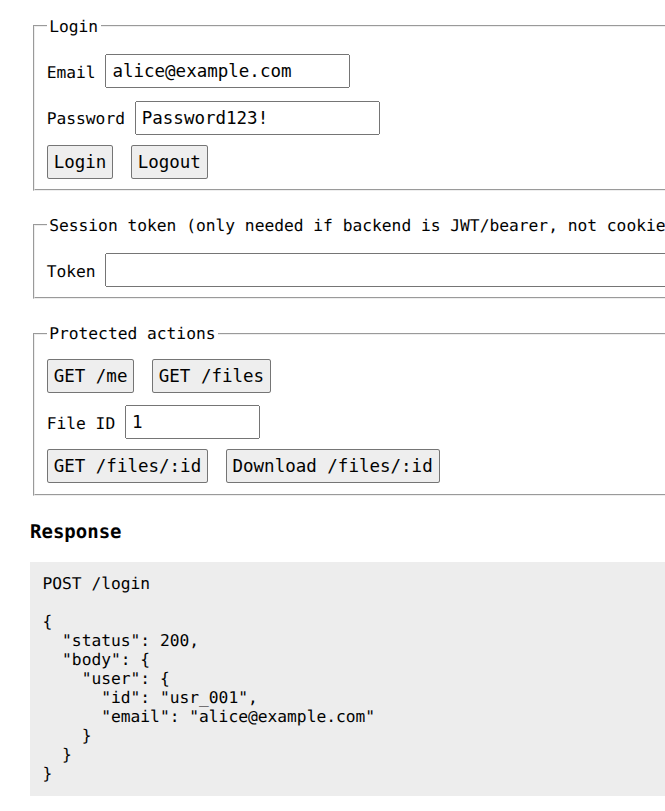

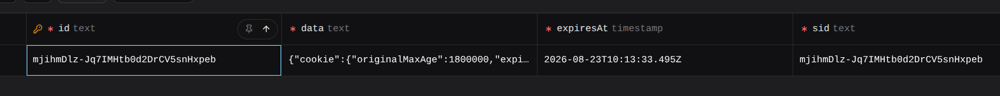

### 7.2 Profile Retrieval (`GET /me`)

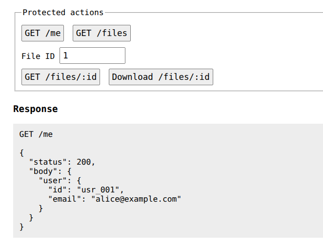

### 7.3 File Listing (`GET /files`)

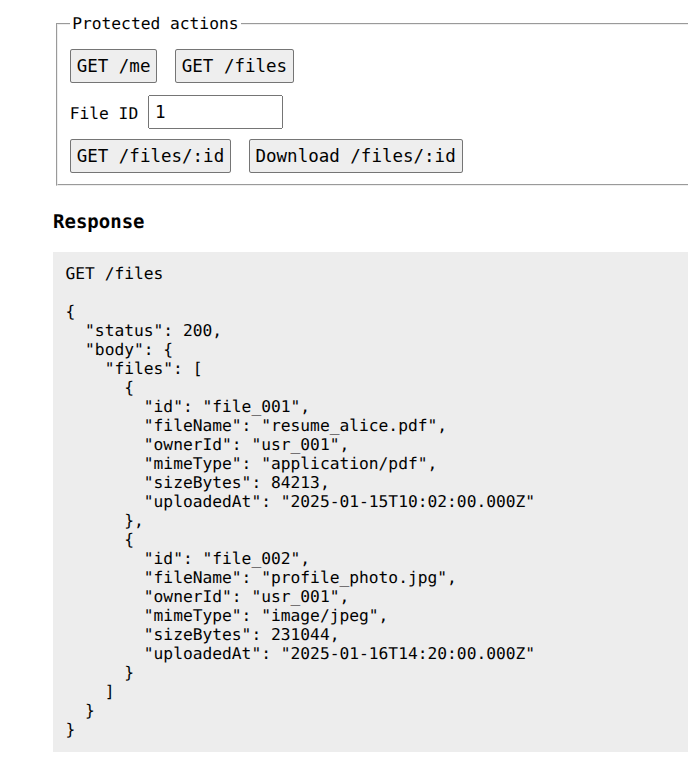

### 7.4 Single File By ID and File Download (`GET /files/:id`)

* **Get Single File for The Logged In User**

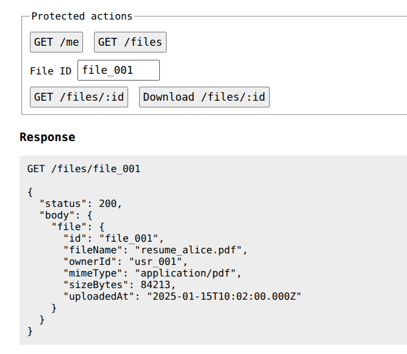

* **Download Single File for The Logged In User**

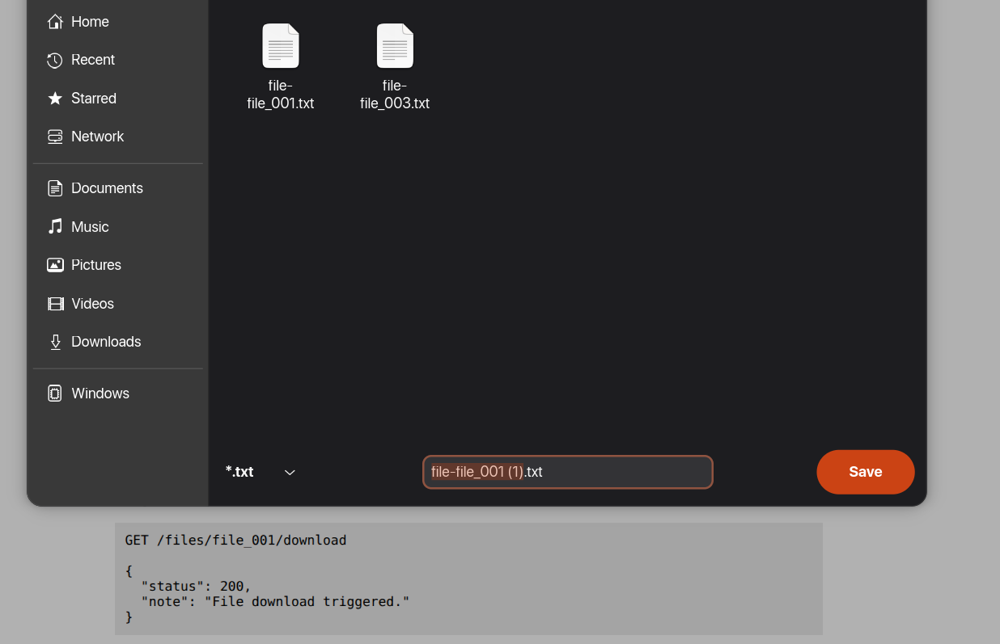

### 7.5 Data Isolation Enforcement (403 Forbidden vs. 404 Not Found)

* **Accessing Another User's File (403 Forbidden):**

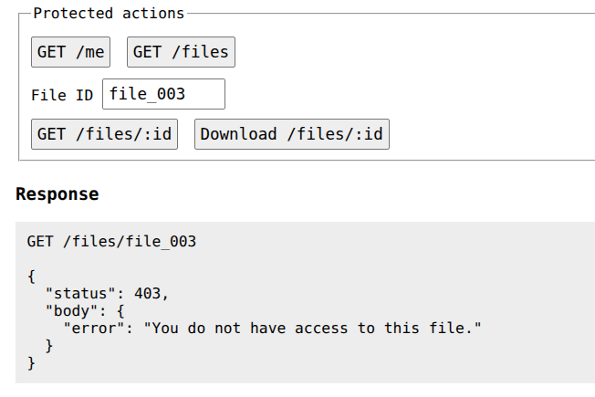

* **Accessing Non-Existent File (404 Not Found):**

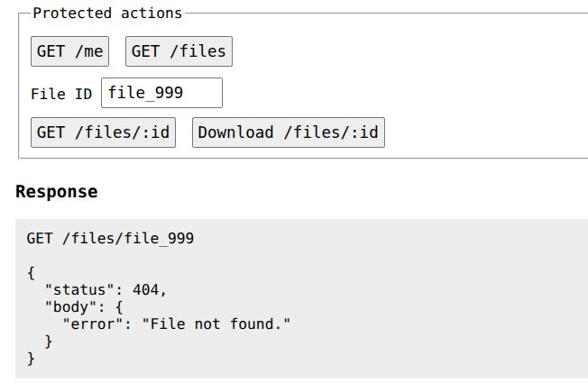

## 7.6 Logout and Server Side Session Key Invalidation

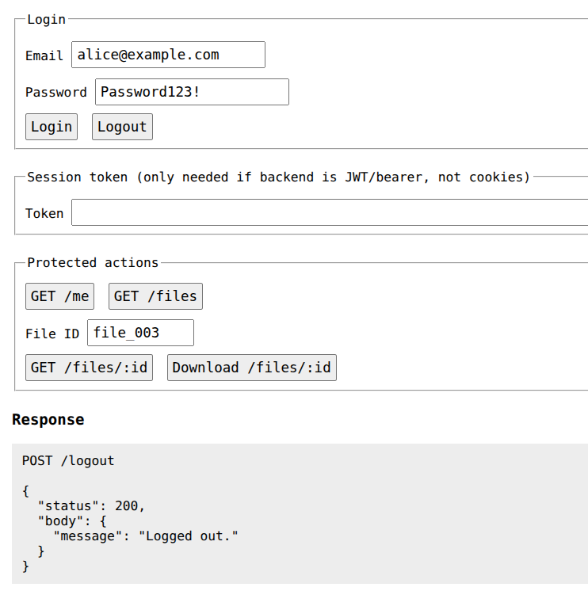

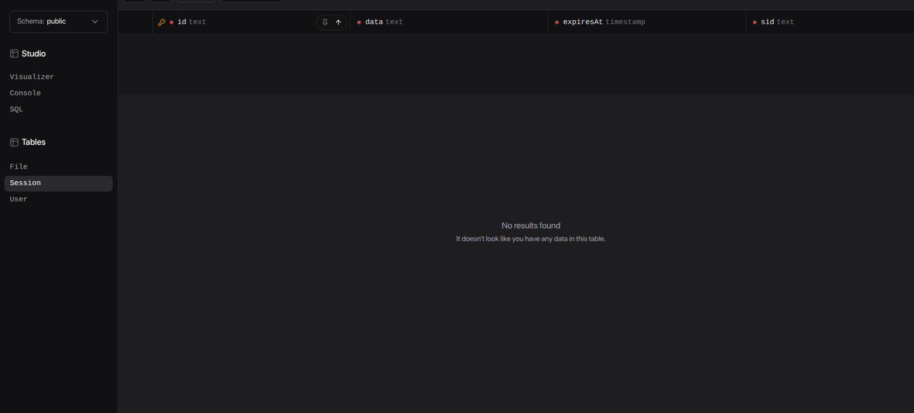

### 7.7 Server-Side Logout Verification (401 Unauthorized after Logout)

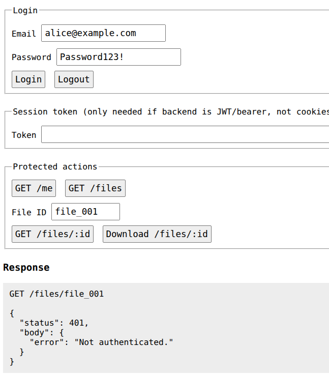

### 7.8 Database State (Users with Hashed Password) (Prisma Studio / Seeding Output)

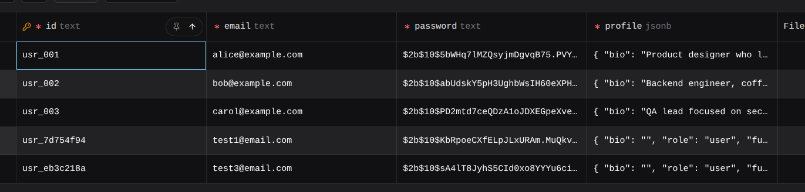
